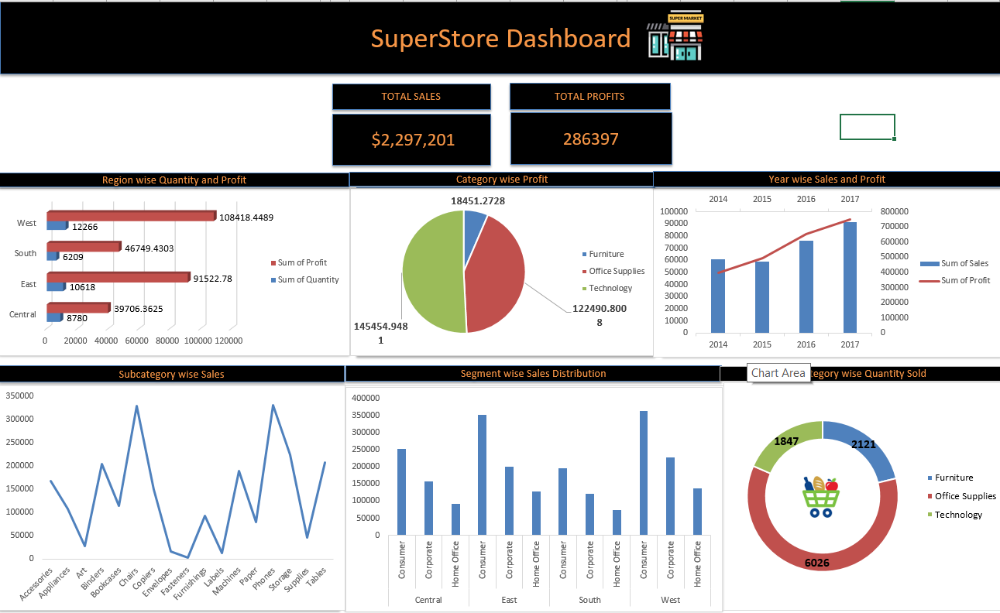

# Superstore-Dashboard-Excel
Excel-based SuperStore dashboard highlighting sales, profit, and inventory performance.

## Project Overview  
This project showcases an **Excel Dashboard** designed for a fictional SuperStore.  
The dashboard highlights **sales performance, inventory management, and customer trends** using advanced Excel features.  

## Features  
-  KPIs for **Total Sales** and **Total Profits**  
-  Region-wise **Quantity & Profit** analysis  
-  Category-wise and Subcategory-wise breakdowns  
-  Year-wise trend of Sales & Profit  
-  Segment-wise Sales Distribution  
-  Dynamic filtering using **Slicers** (Region, Category, Segment, etc.)  
-  Advanced Excel formulas (**VLOOKUP, INDEX/MATCH, SUMIFS, COUNTIFS**) for data analysis  
-  Automated reporting with PivotTables & PivotCharts  

## Dashboard Preview  
  

## Key Insights  
- **West region** generated the highest profits.  
- **Technology category** contributed the largest share of profit.  
- Sales & Profit show a **steady increase year-over-year (2014–2017)**.  
- **Office Supplies** had high sales volume but lower profitability.  

## Tech Stack  
- **Microsoft Excel** (PivotTables, PivotCharts, Slicers, Conditional Formatting)  

## Author  
**Asmin Khan**  
🔗 [LinkedIn](https://www.linkedin.com/in/asmin-khan-5a7bb732b/)  
